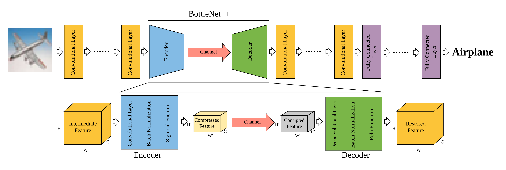

# BottleNetPlusPlus

Code for the [paper](https://arxiv.org/abs/1910.14315): "BottleNet++: An End-to-End Approach for Feature Compression in Device-Edge Co-Inference Systems", which is based on Pytorch.

## Abstract

The emergence of various intelligent mobile applications demands the deployment of powerful deep learning models at resource-constrained mobile devices. The device-edge co-inference framework provides a promising solution by splitting a neural network at a mobile device and an edge computing server. In order to balance the on-device computation and the communication overhead, the splitting point needs to be carefully picked, while the intermediate feature needs to be compressed before transmission. Existing studies decoupled the design of model splitting, feature compression, and communication, which may lead to excessive resource consumption of the mobile device. In this paper, we introduce an end-to-end architecture, named BottleNet++, that consists of an encoder, a non-trainable channel layer, and a decoder for more efficient feature compression and transmission. The encoder and decoder essentially implement joint source-channel coding via convolutional neural networks (CNNs), while explicitly considering the effect of channel noise. By exploiting the strong sparsity and the fault-tolerant property of the intermediate feature in a deep neural network (DNN), BottleNet++ achieves a much higher compression ratio than existing methods. Furthermore, by providing the channel condition to the encoder as an input, our method enjoys a strong generalization ability in different channel conditions. Compared with merely transmitting intermediate data without feature compression, BottleNet++ achieves up to 64x bandwidth reduction over the additive white Gaussian noise channel and up to 256x bit compression ratio in the binary erasure channel, with less than 2\% reduction in accuracy. With a higher compression ratio, BottleNet++ enables splitting a DNN at earlier layers, which leads to up to 3x reduction in on-device computation compared with other compression methods.

## Model Structure

We use a pair of CNNs as encoder and decoder. The communication channel is presented by its transfer function as a non-trainable layer.



## Implementation

We use Pytorch to realize the whole model. For convenient, both ResNet50 and VGG16 are pre-trained and reach 77.81% and 74.04% accuracy, respectively.

### Dependency

```
Pytorch 1.2.0
Torchvision 0.4.0
Numpy 1.6.12
```

### Dataset

```
CIFAR-100
```
### How to Run

`BottleNet++ResNet50.py` and `BottleNet++VGG16.py` use `-div_position` and `-sub_div_position` to control the splitting position (`-sub_div_position` is not used in VGG16).

`-in_dim` means the input dimension of encoder and `-hid_dim` is the encoded channel dimension. `-spatial` controls the spatial shrink.

`-channel` value can be `a` (AWGN channel) or `e` (Binary Erasure Channel) and `-noise` means the channel noise.

`-phase` refers to different training phases illustrated in paper. But for convenient, we provide the pre-train models and skip the first phase.

### Main Experiment Result

#### 256x bit compression ratio

```
python BottleNet++ResNet50.py -in_dim 2048 -hid_dim 32 -div_position 5 -sub_div_position 2 -channel e -noise 0.01
```
```
python BottleNet++VGG16.py -in_dim 512 -hid_dim 8 -div_position 13 -channel e -noise 0.01
```

#### 64x bandwidth reduction
```
python BottleNet++ResNet50.py -in_dim 2048 -hid_dim 32 -div_position 5 -sub_div_position 2 -channel a -noise 0.1
```
```
python BottleNet++VGG16.py -in_dim 512 -hid_dim 8 -div_position 12 -channel a -noise 0.1
```

## Citation

```
@article{shao2019bottlenet++,
  title={BottleNet++: An End-to-End Approach for Feature Compression in Device-Edge Co-Inference Systems},
  author={Shao, Jiawei and Zhang, Jun},
  journal={arXiv preprint arXiv:1910.14315},
  year={2019}
}
```
